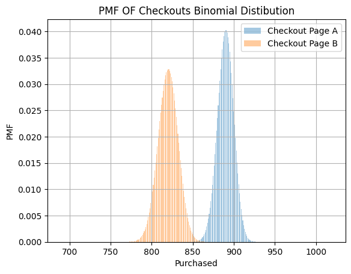

# Checkout Page A B : Which one better ?

A/B testing is a crucial skill for Business Analysts to evaluate which model or solution performs better, enabling us to make impactful and beneficial business decisions. 
The Product team introduced two newly designed checkout pages for our platform. I was assigned the task of determining which checkout page can drive more sales. To do this, I was provided with a dataset containing the A/B testing results for checkout pages A and B. To obtain insights, I will conduct the A/B test analysis using Python.


```python
import pandas as pd
a = pd.read_csv('/Users/tanyanxin/Desktop/JupuyterPlayground/ABtesting.csv')
print(a.head(20))
```

         user_id checkout_page  order_value  purchased gender  browser
    0   45678098             A           40          1      F  firefox
    1   45678067             A           48          1      F   chrome
    2   45678002             A           96          1      F   safari
    3   45678049             A          184          1      F  firefox
    4   45678023             A           40          1      F   chrome
    5   38489419             A           48          1      M   safari
    6   35628929             A           64          1      M  firefox
    7   38427222             A           16          1      M   chrome
    8   18277339             A           24          1      M   safari
    9   39876665             A            8          1      M  firefox
    10  45678098             B           32          1      F  firefox
    11  45678067             B           40          1      F   chrome
    12  45678002             B           96          1      F   safari
    13  45678049             B            0          1      F  firefox
    14  45678023             B           40          1      F   chrome
    15  38489419             B            8          1      M   safari
    16  35628929             B           24          1      M  firefox
    17  38427222             B           32          1      M   chrome
    18  18277339             B          136          1      M   safari
    19  39876665             B           24          1      M  firefox


# Understand the data first

Before progressing too far, I want to understand whether data types and ranges are as expected. Using .info(), it can give a quick overview of data types included in the dataset along with other information such as the number of non-missing values.


```python
a.info()
```

    <class 'pandas.core.frame.DataFrame'>
    RangeIndex: 4000 entries, 0 to 3999
    Data columns (total 6 columns):
     #   Column         Non-Null Count  Dtype 
    ---  ------         --------------  ----- 
     0   user_id        4000 non-null   int64 
     1   checkout_page  4000 non-null   object
     2   order_value    4000 non-null   int64 
     3   purchased      4000 non-null   int64 
     4   gender         4000 non-null   object
     5   browser        4000 non-null   object
    dtypes: int64(3), object(3)
    memory usage: 187.6+ KB


Notice the two column of data are int64. Let me change them to float64 as to represent real numbers.


```python
a['order_value'] = a['order_value'].astype('float64')
a['purchased'] = a['purchased'].astype('float64')
a.info()
```

    <class 'pandas.core.frame.DataFrame'>
    RangeIndex: 4000 entries, 0 to 3999
    Data columns (total 6 columns):
     #   Column         Non-Null Count  Dtype  
    ---  ------         --------------  -----  
     0   user_id        4000 non-null   int64  
     1   checkout_page  4000 non-null   object 
     2   order_value    4000 non-null   float64
     3   purchased      4000 non-null   float64
     4   gender         4000 non-null   object 
     5   browser        4000 non-null   object 
    dtypes: float64(2), int64(1), object(3)
    memory usage: 187.6+ KB


# Distribution of Data

Firstly, let me analyse the gender distribution in the dataset to ensure there is no gender bias in the testing group. 


```python
a['gender'].value_counts()
```


    gender
    F    2000
    M    2000
    Name: count, dtype: int64


```python
a['gender'].value_counts(normalize=True)
```


    gender
    F    0.5
    M    0.5
    Name: proportion, dtype: float64


This 50/50 allows us to generalize our inferences to the rest of the population. 


```python
sample=a.sample(n=100)
sample['gender'].value_counts(normalize=True)
```


    gender
    M    0.55
    F    0.45
    Name: proportion, dtype: float64


If we take a random sample of 100 observations to analyze the gender distribution, we also see that it's 50/50. Good! We are good to proceed the analysis now.


```python
a.groupby('checkout_page')['browser'].value_counts(normalize=True)
```


    checkout_page  browser
    A              firefox    0.40
                   safari     0.35
                   chrome     0.25
    B              chrome     0.35
                   firefox    0.35
                   safari     0.30
    Name: proportion, dtype: float64


Count the distribution of each browser to ensure the count of user is equally distributed for each browser.


```python
a.groupby('checkout_page')[['purchased','order_value']].mean()
```


<div>
<style scoped>
    .dataframe tbody tr th:only-of-type {
        vertical-align: middle;
    }

    .dataframe tbody tr th {
        vertical-align: top;
    }

    .dataframe thead th {
        text-align: right;
    }
</style>
<table border="1" class="dataframe">
  <thead>
    <tr style="text-align: right;">
      <th></th>
      <th>purchased</th>
      <th>order_value</th>
    </tr>
    <tr>
      <th>checkout_page</th>
      <th></th>
      <th></th>
    </tr>
  </thead>
  <tbody>
    <tr>
      <th>A</th>
      <td>0.8890</td>
      <td>48.005</td>
    </tr>
    <tr>
      <th>B</th>
      <td>0.8235</td>
      <td>33.912</td>
    </tr>
  </tbody>
</table>
</div>


```python
nA= a[a['checkout_page']=='A']['purchased'].count()
nB= a[a['checkout_page']=='B']['purchased'].count()

print('Page A users:',nA)
print('Page B users:',nB)

```

    Page A users: 2000
    Page B users: 2000


```python
pA= a[a['checkout_page']=='A']['purchased'].mean()
pB= a[a['checkout_page']=='B']['purchased'].mean()

print('Page A purchase rate:',pA)
print('Page B purchase rate:',pB)

```

    Page A purchase rate: 0.889
    Page B purchase rate: 0.8235


Based on the data, Page A has slightly better purchased rate than B.

# Binomial distribution

Let me plot Probability Mass Function (PMF) for a Binomial distribution to describe and compare between Checkout Page A and B. 


```python
from scipy.stats import binom
import numpy as np
import matplotlib.pyplot as plt

# Define the parameters
nA = 1000  # number of trials for Checkout Page A
nB = 1000  # number of trials for Checkout Page B
pA = 0.89  # probability of success for Checkout Page A
pB = 0.82  # probability of success for Checkout Page B

# Range of x values around the expected number of successes
x = np.arange(nA*pA - 200, nB*pB + 200) 

#Probability Mass Function
binom_a = binom.pmf(x, nA, pA)
binom_b = binom.pmf(x, nB, pB)

# Plotting
plt.bar(x, binom_a, alpha=0.4, label='Checkout Page A')
plt.bar(x, binom_b, alpha=0.4, label='Checkout Page B')
plt.xlabel('Purchased')
plt.ylabel('PMF')
plt.title('PMF OF Checkouts Binomial Distibution')
plt.legend()
plt.grid(True) 
plt.show()

```


    

    


1. Comparing Checkout Page A and Checkout Page B:

Checkout Page A (blue) shows a peak around 900 purchases, indicating that a higher number of users are expected to make purchases compared to Checkout Page B (orange) which shows a peak around 850 purchase.
From the plot, it is clear that Checkout Page A is more successful in leading users to purchase, as its PMF is shifted to the right (higher number of purchases).

2. Spread (Variance):

The shape of the distribution indicates the spread or variance. Both distributions have a relatively narrow peak, which means that the number of purchases is fairly concentrated around their respective means (850 for B and 900 for A).A narrower PMF indicates less variance, suggesting that the results are consistent and not highly variable.

Summary:
Checkout Page A tends to yield more purchases, with its peak around 900.
Checkout Page B yields fewer purchases, with its peak around 850.
The separation between the two peaks indicates that Checkout Page A is likely more effective in terms of conversion.


win: Checkout Page A!

# Normal Distribution

Binomial distributions tell us the probabilities of certain number of users purchasing in each Checkout Page, but they don't tell us anything about the long-term purchase probability of the overall if we were to present either checkout page to the users. To do so, let me make inferences on the means using a normal distribution to see their respective probabilities of success in leading users to complete a purchase. 


```python
from scipy.stats import norm
import numpy as np
import matplotlib.pyplot as plt
import seaborn as sns

# Define the parameters
nA = 1000  # number of trials for Checkout Page A
nB = 1000  # number of trials for Checkout Page B
pA = 0.89  # probability of success for Checkout Page A
pB = 0.82  # probability of success for Checkout Page B

# Create a figure and axis
fig, ax = plt.subplots()

# Define the x rang
x = np.linspace(0.75, 0.96, 500)

# Calculate normal distribution PDFs for two pages
norm_a = norm.pdf(x, pA, np.sqrt(pA*(1-pA)/nA))
norm_b = norm.pdf(x, pB, np.sqrt(pB*(1-pB)/nB))

# Plot the normal distributions using seaborn
sns.lineplot(x=x, y=norm_a, ax=ax, label='Checkout Page A')
sns.lineplot(x=x, y=norm_b, color='orange', ax=ax, label='Checkout Page B')

# Add vertical lines for the means of the distribution
ax.axvline(pA,linestyle='--', color='blue')
ax.axvline(pB,linestyle='--', color='orange')

# Add labels and show plot
plt.xlabel('x')
plt.ylabel('PDF')
plt.grid(True) 
plt.show()

```


    

    


1. Comparison of Checkout Pages:
Checkout Page A (blue line) has a higher peak around a probability of success of 0.89, indicating that it's more successful in generating purchases compared to Checkout Page B.
Checkout Page B (orange line) has its peak around 0.82, which is lower than Page A, indicating that fewer users are completing purchases on this page.

2. Statistical Significance:
The difference between the success probabilities is calculated as d = 0.89 - 0.82 = 0.07.
Since this difference is not equal to zero, you can conclude that there is a non-zero difference between the performance of the two checkout pages.
As the difference is not zero, the null hypothesis, which states that both checkout pages perform equally, can be rejected.

3. Spread of Distributions:
The spread (variance) of both distributions is narrow, indicating that the probabilities of success are consistent for both pages within the displayed range.

Summary:
Checkout Page A is statistically more effective in converting users into purchasers, as shown by the difference in the means of the two normal distributions.
The plot demonstrates that the difference is statistically significant and large enough to reject the null hypothesis, leading to the conclusion that Checkout Page A is a better option for maximizing purchases.


win: Checkout Page A!

# Size Effect

i want to know if my sample size of 1000 enough or not. Does each testing user bring small or big impact to the test. If each testing user bring quite large effect size to the test, it might need to increase my sample size to run the testing. 


```python
from statsmodels.stats.proportion import proportion_effectsize
effectsize = proportion_effectsize(0.89,0.82)
print(effectsize)
```

    0.20016755160767952


0.2 is still considered as smaller effect, so no need to increase sample size. I can proceed to run my A/B Testing analysis. 

# Plotting of the data


```python
sns.displot(data=a, x='order_value', hue='checkout_page', kde=True)
```


    <seaborn.axisgrid.FacetGrid at 0x12e94f510>


    

    


By glancing over the distributions, i can already confirm that checkout page A (blue) has the widest spread of values and B (orange) has the narrowest spread but highest average order value.

For smaller order values (0-25), Checkout Page B (orange) has slightly more orders than Checkout Page A (blue).
In the mid-range (25-75), both checkout pages have similar distributions with a few noticeable differences. For example, Page A seems to perform slightly better in some of these ranges.
For higher order values (100+), Checkout Page A appears to have more orders than Checkout Page B, though this segment has fewer overall orders.

Checkout Page B seems to perform better for low-value orders, while Checkout Page A tends to have more high-value orders.If the goal is to maximize higher-value orders, Checkout Page A might be the better option based on this visualization. Conversely, for low-value, high-frequency orders, Checkout Page B may be more effective.

win: Checkout Page A!

# Chi-square Test

As i already know, value of both checkout page, i am curious to know if the type of browser that user used will impact the performance of our checkout page and eventually impact the conversion rate. Hence, let's use Chi-square Test: Assesses the association between two categorical variables.
Examine the purchase rate metric's dependence on the browser used by the testing user.

To test whether these two variables (type of browser and purchase rate) are independant, let me set a hypothesis first. 
Null Hypothesis: The variables are independant. 
Althernative Hyothesis: The variables are not independant. 


```python
from scipy import stats
# Calculate the number of purchase in each browser
n1 = a[a['browser'] == 'firefox']['user_id'].count()
n2 = a[a['browser'] == 'chrome']['user_id'].count()
n3 = a[a['browser'] == 'safari']['user_id'].count()

# Compute purchase in each browser
p_1= a[a['browser'] == 'firefox'].groupby('user_id')['purchased'].max().sum()
no_purchase_1 = n1 - p_1
p_2= a[a['browser'] == 'chrome'].groupby('user_id')['purchased'].max().sum()
no_purchase_2 = n2 - p_2
p_3= a[a['browser'] == 'safari'].groupby('user_id')['purchased'].max().sum()
no_purchase_3 = n3 - p_3

# Create the signups table
table = [[p_1, no_purchase_1], [p_2, no_purchase_2],[p_3,no_purchase_3]]
print('Firefox purchase rate:',round(p_1/n1,3))
print('Chrome purchase rate:',round(p_2/n2,3))
print('Safari purchase rate:',round(p_3/n3,3))

```

    Firefox purchase rate: 0.007
    Chrome purchase rate: 0.008
    Safari purchase rate: 0.008


```python
# Calculate p-value of this chi-square test
print('p-value=',stats.chi2_contingency(table,correction=False)[1])
```

    p-value= 0.9939900157835582


If the p-value (probability of observing such a statistic) is less than your significance level (5% significance threshold), you reject the null hypothesis.
The p-value seems very large and the rates are close. 
This means that we have no evidence to believe that the purchase rates between the browser are different or depend on these landing page variants.We can not reject the Null Hypothesis so these two variable are independent. 

I can conclude that there is no a significant association between type of browser and purchased rate.

# Conclusion

I recommend that the Product team adopt Checkout Page A as the new default for the platform, as it has demonstrated a higher conversion rate and a greater ability to maximize high-value orders. Additionally, my analysis indicates that the browser type used by customers does not significantly impact the purchase rate.
