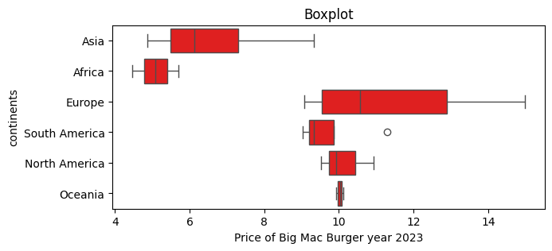
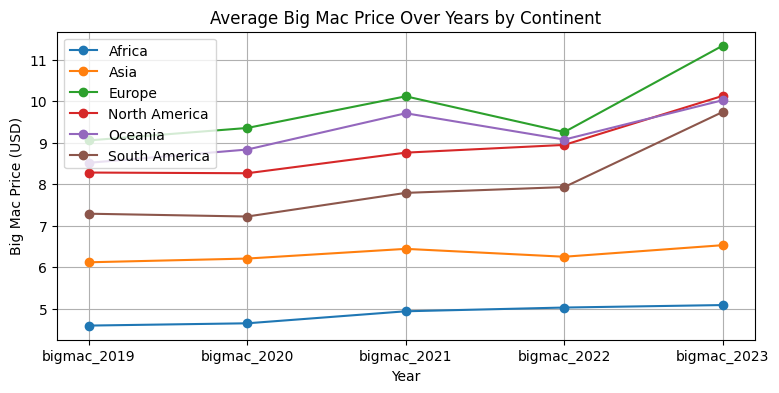
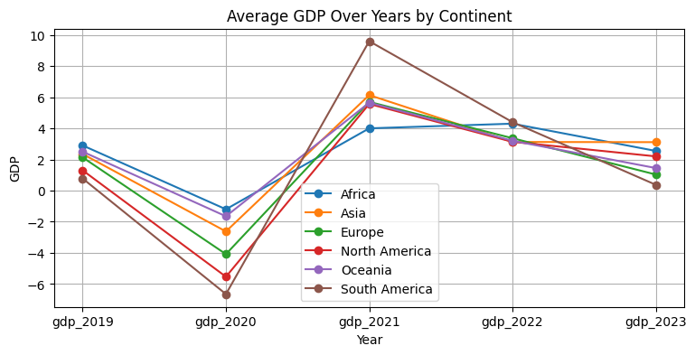
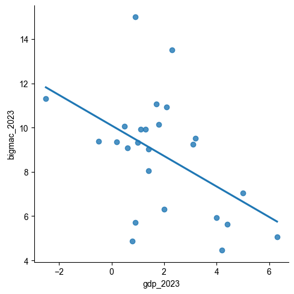
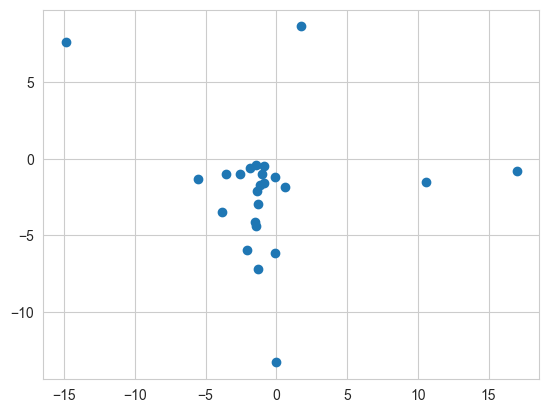
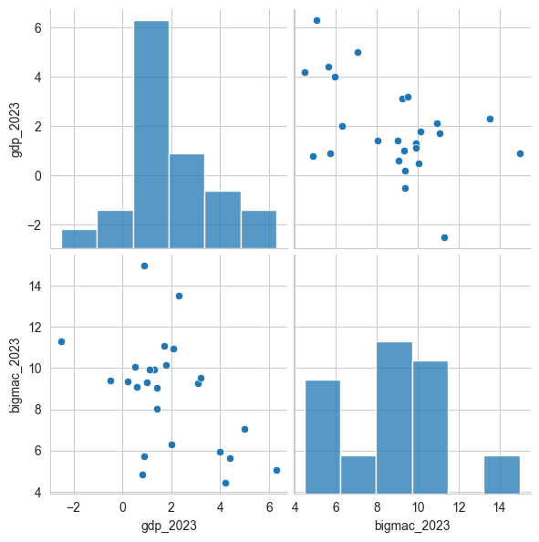
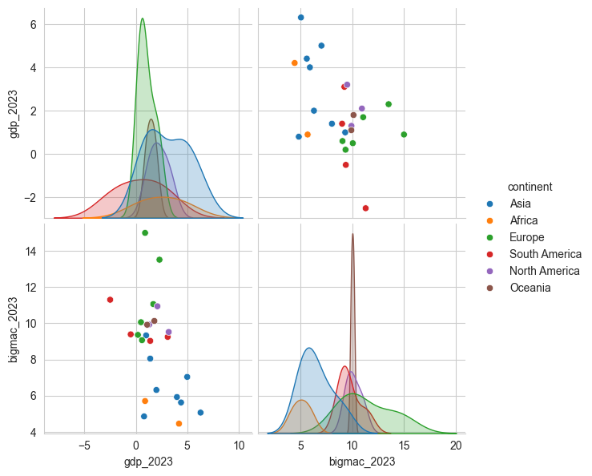
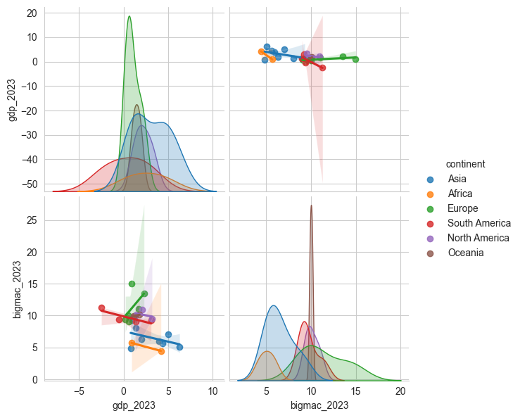

# 1. Initial Exploration

The Big Mac burger is one of the signature items from McDonald's. The price of a Big Mac is an interesting metric for measuring consumer prices in different countries. After the COVID-19 pandemic, inflation has become a widespread phenomenon affecting most countries around the world. To analyze the inflation rates across various nations, I explored consumer prices by focusing on the price of a Big Mac, as McDonald's operates in nearly every country. For this analysis, I have gathered Big Mac pricing data from 24 countries across 6 continents.

Let's delve into the data to see what insights it can reveal.
<div>

</div>


```python
import pandas as pd
a = pd.read_csv('/Users/tanyanxin/Desktop/JupuyterPlayground/big_mac_country.csv')
print(a.head(25))
```

            continent         country  bigmac_2019  bigmac_2020  bigmac_2021   
    0            Asia           China         6.10         6.22         6.92  \
    1          Africa    South Africa         4.42         4.01         4.44   
    2          Europe         Denmark         9.11         9.05         9.65   
    3   South America          Brazil         9.14         8.72         8.34   
    4   North America    United State         9.42         9.64         9.82   
    5            Asia        Malaysia         4.33         4.67         4.83   
    6            Asia          Taiwan         4.55         4.85         5.14   
    7          Europe  Czech Republic         7.54         7.56         8.20   
    8   South America       Argentina         4.87         6.36         7.69   
    9   North America          Canada        10.24        10.26        10.60   
    10           Asia       Singapore         8.54         8.63         8.75   
    11         Africa           Egypt         4.76         5.28         5.43   
    12         Europe          Poland         5.64         5.69         6.95   
    13  South America        Colombia         7.42         6.91         7.11   
    14  North America          Mexico         5.18         4.89         5.86   
    15           Asia           Japan         7.18         7.18         7.29   
    16         Europe          Norway        10.71        11.52        12.39   
    17           Asia           India         5.22         5.18         5.14   
    18         Europe     Switzerland        13.16        13.62        14.33   
    19           Asia       Hong Kong         5.18         5.28         5.35   
    20           Asia     South Korea         7.83         7.64         8.10   
    21        Oceania       Australia         8.61         9.03         9.78   
    22         Europe  United Kingdom         8.17         8.69         9.19   
    23  South America           Chile         7.72         6.89         8.02   
    24        Oceania    New Zealand          8.42         8.64         9.64   
    
        bigmac_2022  bigmac_2023  gdp_2019  gdp_2020  gdp_2021  gdp_2022  gdp_2023  
    0          7.39         7.04       6.0       2.2       8.4       3.0       5.0  
    1          4.92         5.71       0.3      -6.0       4.7       1.9       0.9  
    2          4.82        11.06       1.5      -2.4       6.8       2.7       1.7  
    3          8.56         9.25       1.2      -3.3       5.0       2.9       3.1  
    4         10.19        10.94       2.3      -2.8       5.9       2.1       2.1  
    5          4.84         5.93       4.4      -5.5       3.3       8.7       4.0  
    6          5.20         4.86       3.1       3.4       6.5       2.4       0.8  
    7          8.08         9.36       3.0      -5.5       3.6       2.3       0.2  
    8          8.85        11.30      -2.0      -9.9      10.7       5.0      -2.5  
    9          9.88         9.93       1.9      -5.1       5.0       3.4       1.3  
    10         8.60         9.33       1.3      -3.9       8.9       3.6       1.0  
    11         5.13         4.46       5.5       3.6       3.3       6.7       4.2  
    12         7.03         9.07       4.4      -2.0       6.9       5.1       0.6  
    13         6.77         9.03       3.2      -7.3      11.0       7.3       1.4  
    14         6.77         9.52      -0.3      -8.7       5.8       3.9       3.2  
    15         6.21         6.32      -0.4      -4.2       2.2       1.0       2.0  
    16        12.66        13.51       1.1      -1.3       3.9       3.3       2.3  
    17         4.94         5.07       3.9      -5.8       9.1       7.2       6.3  
    18        13.69        14.99       1.2      -2.3       5.4       2.7       0.9  
    19         5.50         5.63      -1.7      -6.5       6.4      -3.5       4.4  
    20         7.32         8.05       2.2      -0.7       4.3       2.6       1.4  
    21         9.13        10.13       1.9      -1.8       5.2       3.7       1.8  
    22         9.26        10.06       1.6     -11.0       7.6       4.1       0.5  
    23         7.54         9.39       0.7      -6.1      11.7       2.4      -0.5  
    24         9.02         9.92       3.1      -1.5       6.1       2.7       1.1  


Before progressing too far in the analysis, I want to understand whether data types and ranges are as expected. Using .info(), it can give a quick overview of data types included in the dataset along with other information such as the number of non-missing values.

Let's dive in.


```python
a.info()
```

    <class 'pandas.core.frame.DataFrame'>
    RangeIndex: 53 entries, 0 to 52
    Data columns (total 12 columns):
     #   Column       Non-Null Count  Dtype  
    ---  ------       --------------  -----  
     0   continent    25 non-null     object 
     1   country      25 non-null     object 
     2   bigmac_2019  25 non-null     float64
     3   bigmac_2020  25 non-null     float64
     4   bigmac_2021  25 non-null     float64
     5   bigmac_2022  25 non-null     float64
     6   bigmac_2023  25 non-null     float64
     7   gdp_2019     25 non-null     float64
     8   gdp_2020     25 non-null     float64
     9   gdp_2021     25 non-null     float64
     10  gdp_2022     25 non-null     float64
     11  gdp_2023     25 non-null     float64
    dtypes: float64(10), object(2)
    memory usage: 5.1+ KB


To quickly view the data further more,let me counting the occurrences of different values in "continent" column. 


```python
a.value_counts("continent")
```


    continent
    Asia             8
    Europe           6
    South America    4
    North America    3
    Africa           2
    Oceania          2
    Name: count, dtype: int64


Perhaps I would like to check the range of pricing of Big Mac during year 2023 among six continents. The range can be presented by boxplot as boxplot shows the boundaries of each quartile of pricing data. 


```python
import seaborn as sns
import matplotlib.pyplot as plt
print(a["bigmac_2023"].min(),a["bigmac_2023"].max())
plt.figure(figsize=(7, 3))
sns.boxplot(data=a,x="bigmac_2023",y="continent", color='red')
plt.xlabel('Price of Big Mac Burger year 2023')
plt.ylabel('continents')
plt.title('Boxplot')
plt.show()
```

    4.46 14.99


    

    


The boxplot shows the distribution of Big Mac prices in 2023 across different continents. Each box represents the interquartile range (IQR) of prices, with the line inside the box indicating the median price. Based on the boxplot, we can see Eurepoer have the most highest price of big Mac and also most biggest difference of price. 

# 2. Data Summarization

Let's see what are the country which has the maximum price out of each continents during year 2023. 


```python
ymax = a.groupby(["continent"])["bigmac_2023"].idxmax()
max2023 = a.loc[ymax]
print(max2023)
```

            continent       country  bigmac_2019  bigmac_2020  bigmac_2021   
    1          Africa  South Africa         4.42         4.01         4.44  \
    10           Asia     Singapore         8.54         8.63         8.75   
    18         Europe   Switzerland        13.16        13.62        14.33   
    4   North America  United State         9.42         9.64         9.82   
    21        Oceania     Australia         8.61         9.03         9.78   
    8   South America     Argentina         4.87         6.36         7.69   
    
        bigmac_2022  bigmac_2023  gdp_2019  gdp_2020  gdp_2021  gdp_2022  gdp_2023  
    1          4.92         5.71       0.3      -6.0       4.7       1.9       0.9  
    10         8.60         9.33       1.3      -3.9       8.9       3.6       1.0  
    18        13.69        14.99       1.2      -2.3       5.4       2.7       0.9  
    4         10.19        10.94       2.3      -2.8       5.9       2.1       2.1  
    21         9.13        10.13       1.9      -1.8       5.2       3.7       1.8  
    8          8.85        11.30      -2.0      -9.9      10.7       5.0      -2.5  


Let's see what are the country which has the maximum price out of each continents during year 2023. 


```python
ymax = a.groupby(["continent"])["bigmac_2019"].idxmax()
max2019 = a.loc[ymax]
print(max2019)
```

            continent      country  bigmac_2019  bigmac_2020  bigmac_2021   
    11         Africa        Egypt         4.76         5.28         5.43  \
    10           Asia    Singapore         8.54         8.63         8.75   
    18         Europe  Switzerland        13.16        13.62        14.33   
    9   North America       Canada        10.24        10.26        10.60   
    21        Oceania    Australia         8.61         9.03         9.78   
    3   South America       Brazil         9.14         8.72         8.34   
    
        bigmac_2022  bigmac_2023  gdp_2019  gdp_2020  gdp_2021  gdp_2022  gdp_2023  
    11         5.13         4.46       5.5       3.6       3.3       6.7       4.2  
    10         8.60         9.33       1.3      -3.9       8.9       3.6       1.0  
    18        13.69        14.99       1.2      -2.3       5.4       2.7       0.9  
    9          9.88         9.93       1.9      -5.1       5.0       3.4       1.3  
    21         9.13        10.13       1.9      -1.8       5.2       3.7       1.8  
    3          8.56         9.25       1.2      -3.3       5.0       2.9       3.1  


# 3. Data Visualization

Let's visualize the big Mac price of country across year 2019 to 2023. 


```python
import pandas as pd
import matplotlib.pyplot as plt

bigmac_by_continent = a.groupby('continent')[['bigmac_2019', 'bigmac_2020', 'bigmac_2021', 'bigmac_2022', 'bigmac_2023']].mean()

# Plotting
plt.figure(figsize=(9, 4)) 
for continent in bigmac_by_continent.index:
    plt.plot(bigmac_by_continent.columns, bigmac_by_continent.loc[continent], marker='o', label=continent)

plt.xlabel('Year')
plt.ylabel("Big Mac Price (USD)")
plt.title('Average Big Mac Price Over Years by Continent')
plt.legend()
plt.grid(True)  # Add gridlines for better readability
plt.show()

```


    

    


We see a steadily upward trending graph for all six continents. Europe spiked the highest and also has the highest price of Big Mac across year 2019 to year 2023. Meanwhile, Africa showed quite a constant pricing from year 2019 to year 2023.

Let's visualize the GDP of country across year 2019 to 2023.


```python
import pandas as pd
import matplotlib.pyplot as plt

gdp_by_continent = a.groupby('continent')[['gdp_2019', 'gdp_2020', 'gdp_2021', 'gdp_2022', 'gdp_2023']].mean()

plt.figure(figsize=(9, 4))
for continent in gdp_by_continent.index:
    plt.plot(gdp_by_continent.columns, gdp_by_continent.loc[continent], marker='o', label=continent)

plt.xlabel('Year')
plt.ylabel('GDP')
plt.title('Average GDP Over Years by Continent')
plt.legend()
plt.grid(True) 
plt.show()

```


    

    


The GDP of six continents were dropped in year 2020, and went upward in year 2021. After year 2021, GDP of continent went down steadily and even back the same number in year 2019.

Based on the visualization, we can predict that the pandamic did indirectly cause the GDP going down, and recovering in the year after. However, after the GDP recovery, the big Mac price of six continent did not reduce but grow steadily.

To validate the prediction, let's visualize the relationship between big Mac price and GDP of the latest year from the dataset. 

# 4. Visualizaing the Relationship


```python
sns.lmplot(x="gdp_2023", y="bigmac_2023", data=a, ci=None)
sns.set_style("whitegrid")
plt.show()
```


    

    


```python
cor = a['gdp_2023'].corr(a['bigmac_2023'])
print(cor)
```

    -0.4884501554341597


The -0.48 tells the negative relationship between the GDP and Big Mac price. The sign of the correlation coefficient corresponds to the direction of the relationship, meaning to say when the GDP is lower, the Big Mac price is unlikely lower.

By visualizing the correlation of level might not be accurate to identify the correlation of two time series data. Therefore, let me also check the correlation of precentage changes fo these two time series. 


```python
# Compute percent change using pct_change()
a['gdp_2023'] = a['gdp_2023'].pct_change()
a['bigmac_2023'] = a['bigmac_2023'].pct_change()

# Compute correlation using corr()
correlation = a['gdp_2023'].corr(a['bigmac_2023'])
print("Correlation of gdp and bigmac: ", correlation)

# Make scatter plot
plt.scatter(a['gdp_2023'],a['bigmac_2023'])
plt.show()
```

    Correlation of gdp and bigmac:  -0.1606106924797492


    

    


This indicates a weak negative correlation between the two variables. 
There is a weak negative correlation between the percentage change in GDP and the percentage change in the price of a Big Mac in 2023. This means that while there is a general trend for countries with higher GDP growth to have slightly lower Big Mac price increases, this relationship is not very strong and there are many exceptions.

A pairplot provides a comprehensive way to visualize relationships in a dataset. Let's view the data in multiple plots. 


```python
sns.pairplot(data=a, vars= ["gdp_2023",], height=3)
sns.set_style("whitegrid")
plt.show()
```


    

    


Pairplot effectively visualizes the relationship between GDP in 2023 and the Big Mac index in 2023 across different continents, highlighting variations in distributions and correlations. The use of color coding by continent allows for easy comparison and identification of patterns specific to each region.


```python
sns.pairplot(data=a, hue='continent', vars= ["gdp_2023","bigmac_2023"],height=3)
sns.set_style("whitegrid")
plt.show()
```


    

    


For better visualization, let me add a regrssion line fitted for each continents to show the relationship between bigmac_2023 and gdp_2023. 


```python
sns.pairplot(data=a, hue='continent', vars= ["gdp_2023","bigmac_2023"], kind="reg",height=3)
sns.set_style("whitegrid")
plt.show()
```


    

    


# 5. Conclusion

The scatter plots and regression lines indicate similar observations: a negative correlation between GDP and the Big Mac index. I can conclude that this relationship between GDP growth of a country and its BigMac Burger price is not very strong and there are many exceptions.
Some interesting insights were found based on the analysis at above:
Europe: Generally higher GDP values and a moderate spread in Big Mac index values.
Africa: Lower GDP values with a wider spread in Big Mac index values.
North America: A distinct peak in the Big Mac index at 10 dollar, indicating a concentration of values around this point.
South America and Oceania: Show varied trends but generally align with the negative correlation observed.
