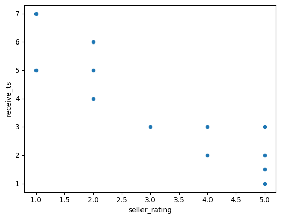
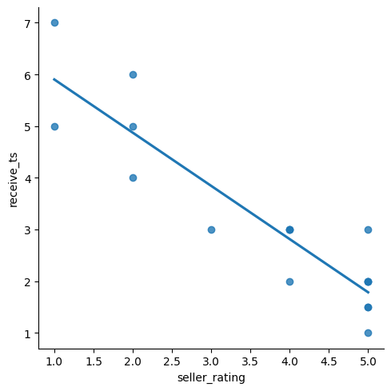

Buyer waiting lead time is a very important metrics to evualate the performance of an e-commerce platform. A shorter waiting lead time directly correlates with faster parcel delivery, resulting in increased buyer satisfaction. 
Therefore, it is imperative to conduct thorough data analysis to examine the buyer waiting lead time and its potential impact on enhancing buyer satisfaction.

Let's assuming the maximum waiting days of buyer to receive the parcel is 8 days. If the parcel is not shipped within 8 days, the order will be automated cancelled. Assuming the ideal waiting days for buyers to receive the parcel is 3 days, what's the probability of a buyer to receive the parcel if the maximum days is 8 days? Let's use probability distribution by importing uniform from scipy.stats module to get the answer.


# 1. Probability distribution


```python
#min = 0 day
#max = 8 days
from scipy.stats import uniform
prob_less_than_3d = uniform.cdf(3,0,8)
print(prob_less_than_3d)
```

    0.375


Probability of buyer to receive the parcel within 3 days are 0.37 which is 37% chance of rate. If we lower down the expactation, what's the probability for buyer to receive the parcel within 5 to 7 days ?


```python
from scipy.stats import uniform
prob_2d_4d = uniform.cdf(7,0,8)- uniform.cdf(5,0,8)
print(prob_2d_4d)
```

    0.25


Probability of buyer to receive the parcel between 5 to 7 days are 0.25 which is 25% chance of rate. Let's visualize the simulated wait time into a historgram if we assuming the maximum wait time for buyer is 8 days.

# 2. Bring it into histrogram


```python
#min = 0 day
#max = 8 days
import numpy as np
import matplotlib.pyplot as plt

np.random.seed(42)
from scipy.stats import uniform
wait_time = uniform.rvs(0,8,size=100)

plt.hist(wait_time)
plt.show()
```


    

    


# 3. Bionomal distribution

If the buyer have 10 parcels to be receive, what's the probability of buyer to receive within 3 days? Let's calculate using bionamal distribution.


```python
#binomal distribution
from scipy.stats import binom
np.random.seed(42)
successful_delivery = binom.pmf(5,10,0.375)
print(successful_delivery.mean())

#if buyer buy 10 products, there is about 17% chance that 5 of them will be shipped within 3 days
```

    0.17822021618485454


If buyer have 10 parcels to be received, there is about 17% chance that half of them will be shipped within 3 days.
Other than just culculating the probability of a fast shipping, it is also important to check what's the variable that will impact buyer waiting time.

Let's started by exploring the data given.

# 4. View the data


```python
import pandas as pd
a = pd.read_csv('/Users/tanyanxin/Desktop/JupuyterPlayground/buyer_receive_ts.csv')
print(a.head())
```

        buyer_id  receive_ts  parcel_id parcel_value  seller_id  seller_rating
    0  301234567         2.0    8697403      $678.00    1234567              5
    1  300934568         3.0    5879403        $3.00     934568              4
    2  306730292         2.0    3850308        $8.00    6730292              4
    3  303830484         2.0    8697401       $65.00    3830484              5
    4  301234565         3.0    5879402        $4.00    1234565              3


# 5. Top 5 seller which have best rating 

Looking into the data, I found an interesting field which is the seller rating that was made by buyer who has previosuly made purchases with that seller.Let's sort each order by seller rating.


```python
c = a.sort_values(by='seller_rating', ascending=False)
c.head(50)
```


<table border="1" class="dataframe">
  <thead>
    <tr style="text-align: right;">
      <th></th>
      <th>buyer_id</th>
      <th>receive_ts</th>
      <th>parcel_id</th>
      <th>parcel_value</th>
      <th>seller_id</th>
      <th>seller_rating</th>
    </tr>
  </thead>
  <tbody>
    <tr>
      <th>0</th>
      <td>301234567</td>
      <td>2.0</td>
      <td>8697403</td>
      <td>$678.00</td>
      <td>1234567</td>
      <td>5</td>
    </tr>
    <tr>
      <th>6</th>
      <td>301234567</td>
      <td>1.5</td>
      <td>4869385</td>
      <td>$90.00</td>
      <td>1234567</td>
      <td>5</td>
    </tr>
    <tr>
      <th>15</th>
      <td>301234558</td>
      <td>1.5</td>
      <td>8023455</td>
      <td>$34.00</td>
      <td>1234558</td>
      <td>5</td>
    </tr>
    <tr>
      <th>12</th>
      <td>301234571</td>
      <td>3.0</td>
      <td>3958624</td>
      <td>$299.99</td>
      <td>1234571</td>
      <td>5</td>
    </tr>
    <tr>
      <th>9</th>
      <td>303830412</td>
      <td>2.0</td>
      <td>7368590</td>
      <td>$2.00</td>
      <td>3830412</td>
      <td>5</td>
    </tr>
    <tr>
      <th>16</th>
      <td>301234104</td>
      <td>1.0</td>
      <td>1234726</td>
      <td>$16.00</td>
      <td>1234104</td>
      <td>5</td>
    </tr>
    <tr>
      <th>3</th>
      <td>303830484</td>
      <td>2.0</td>
      <td>8697401</td>
      <td>$65.00</td>
      <td>3830484</td>
      <td>5</td>
    </tr>
    <tr>
      <th>5</th>
      <td>305234567</td>
      <td>3.0</td>
      <td>3850306</td>
      <td>$2.00</td>
      <td>5234567</td>
      <td>4</td>
    </tr>
    <tr>
      <th>1</th>
      <td>300934568</td>
      <td>3.0</td>
      <td>5879403</td>
      <td>$3.00</td>
      <td>934568</td>
      <td>4</td>
    </tr>
    <tr>
      <th>2</th>
      <td>306730292</td>
      <td>2.0</td>
      <td>3850308</td>
      <td>$8.00</td>
      <td>6730292</td>
      <td>4</td>
    </tr>
    <tr>
      <th>8</th>
      <td>306730292</td>
      <td>3.0</td>
      <td>5879406</td>
      <td>$7.50</td>
      <td>6730292</td>
      <td>4</td>
    </tr>
    <tr>
      <th>4</th>
      <td>301234565</td>
      <td>3.0</td>
      <td>5879402</td>
      <td>$4.00</td>
      <td>1234565</td>
      <td>3</td>
    </tr>
    <tr>
      <th>7</th>
      <td>300934563</td>
      <td>4.0</td>
      <td>8593042</td>
      <td>$6.99</td>
      <td>934563</td>
      <td>2</td>
    </tr>
    <tr>
      <th>10</th>
      <td>301234585</td>
      <td>5.0</td>
      <td>9476930</td>
      <td>$5.67</td>
      <td>1234585</td>
      <td>2</td>
    </tr>
    <tr>
      <th>14</th>
      <td>301234593</td>
      <td>6.0</td>
      <td>9475639</td>
      <td>$14.00</td>
      <td>1234593</td>
      <td>2</td>
    </tr>
    <tr>
      <th>11</th>
      <td>305234564</td>
      <td>7.0</td>
      <td>8573950</td>
      <td>$301.50</td>
      <td>5234564</td>
      <td>1</td>
    </tr>
    <tr>
      <th>13</th>
      <td>301234276</td>
      <td>5.0</td>
      <td>9486739</td>
      <td>$10.00</td>
      <td>1234276</td>
      <td>1</td>
    </tr>
  </tbody>
</table>
</div>


# 6. Visualizing relationship


```python
import seaborn as sns
sns.scatterplot(x='seller_rating', y='receive_ts',data=a)
plt.show()
```


    

    


# 7. Adding a trendline


```python
sns.lmplot(x='seller_rating', y='receive_ts', data=a, ci=None)
plt.show()
```


    

    


# 8. Computing corralation


```python
sns.lmplot(x='seller_rating', y='receive_ts', data=a, ci=None)
plt.show()
cor = a['seller_rating'].corr(a['receive_ts'])
print(cor)
```


    

    


    -0.9095576586503179


The -0.90 tells the negative strong relationship between the seller rating and receive lead time. The sign of the correlation coefficient corresponds to the direction of the relationship, meaning to say when the seller rating is higher, the receive lead time is usually shorter. 

We could conclude that a seller who has higher rating can usually perform shorter lead time for buyer to receive parcel. However, correlation does not imply causation. We also can not conclude that this relationship imply any causation. 

From the results of the analysis and the trend plot we have done earlier, we could say that the probability for buyer to receive parcel in a shorter lead time is rather low if the platform set the maximum lead time as 8 days. Moreover, a higher rating seller usually can perform faster shipping for buyer.


```python

```
